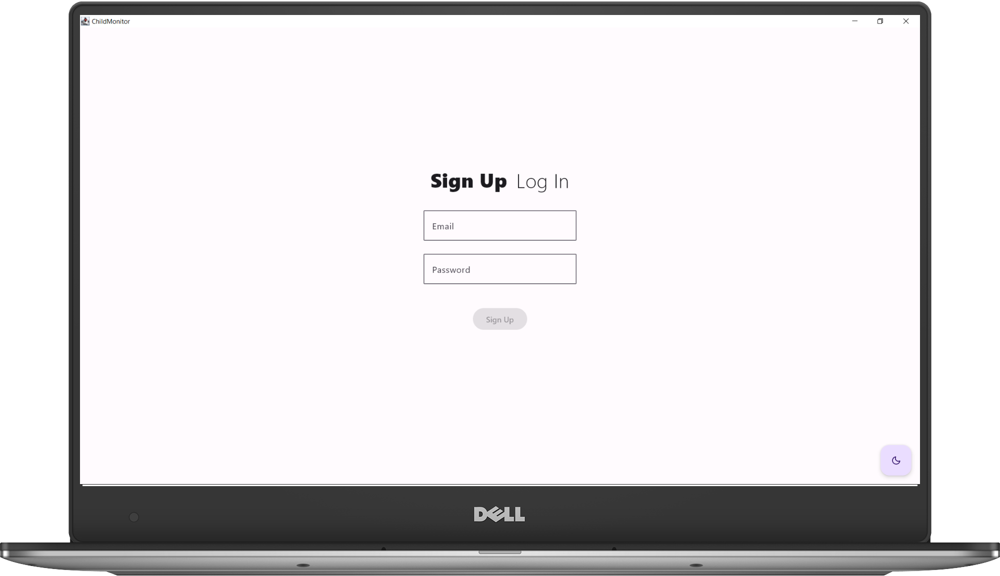
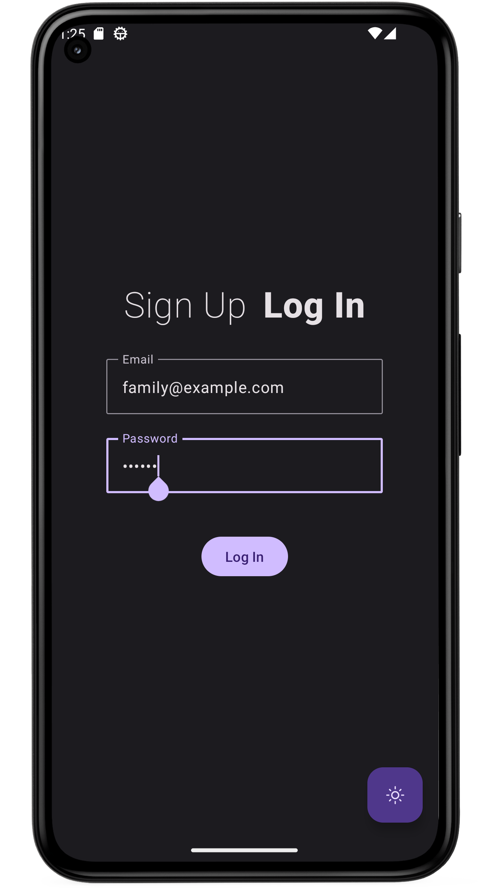
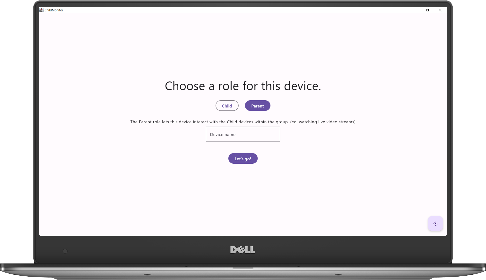
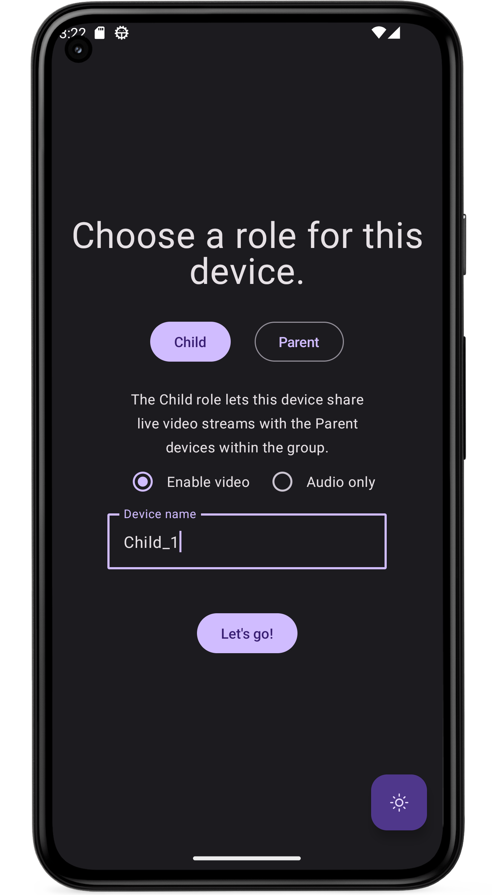
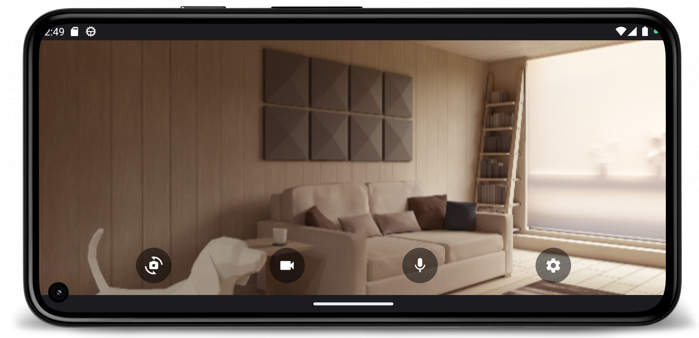
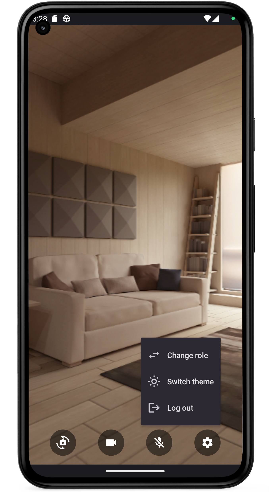
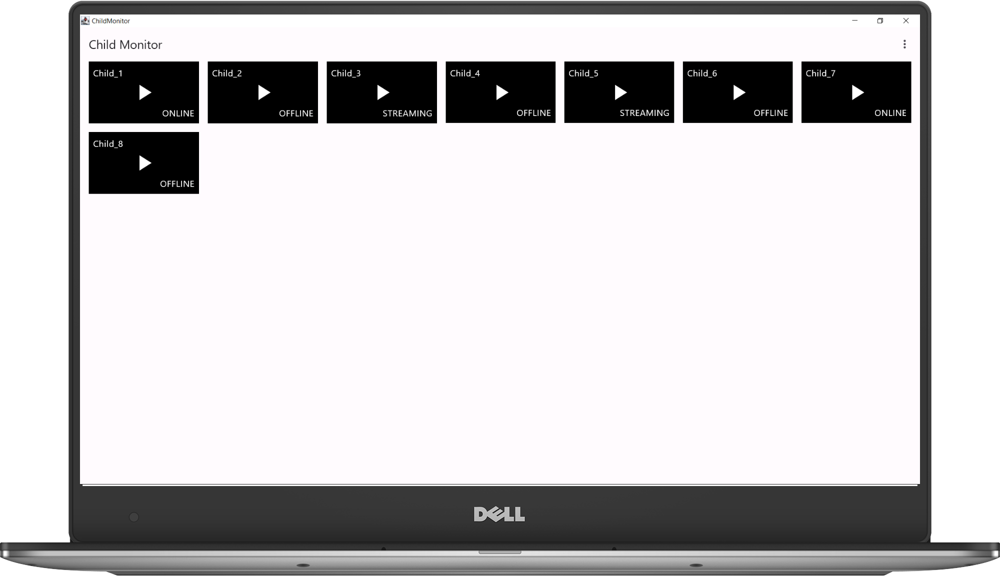
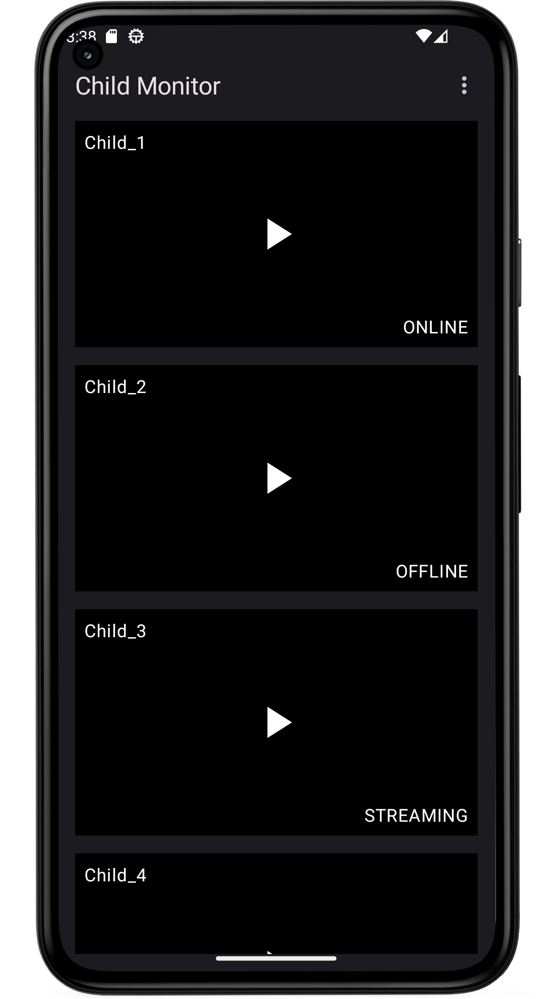
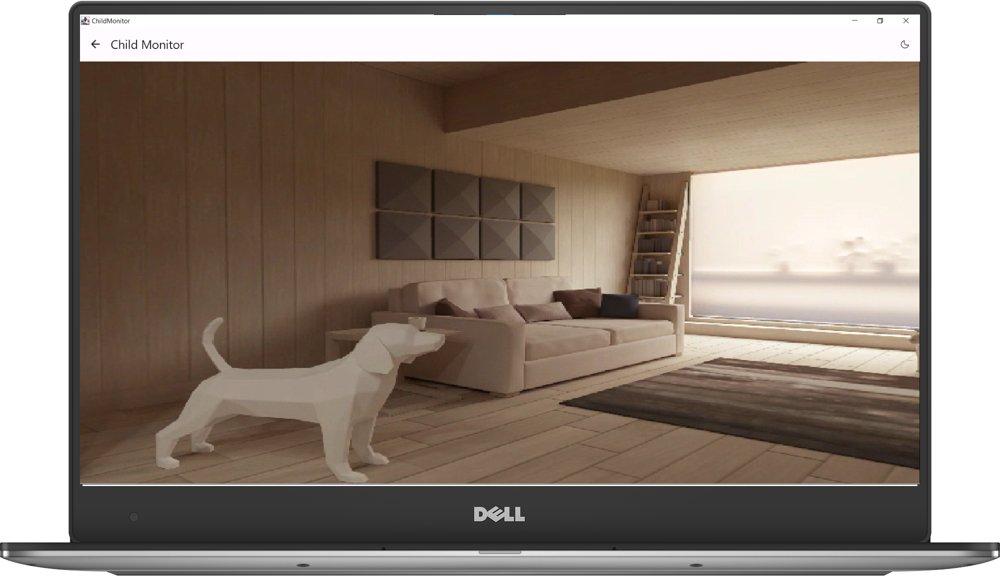
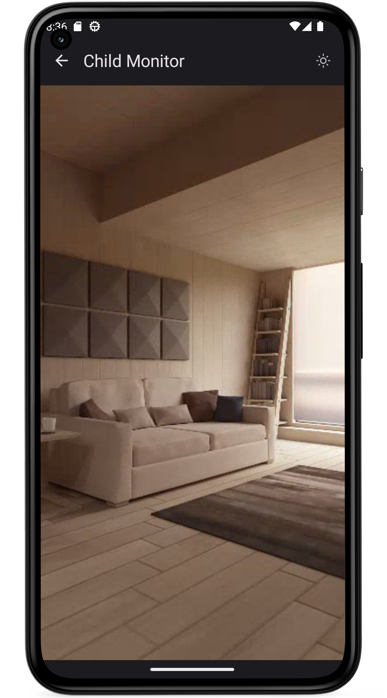

# Child Monitor
A child monitoring app for Android and Desktop, built with *Kotlin Multiplatform*, *Compose Multiplatform*, *Firebase* and *WebRTC*. The application allows devices to be effortlessly set up to stream live video to other devices. With this app, parents and caregivers can conveniently keep an eye on their children by accessing real-time video feeds from anywhere.

## Two roles of the app:
1. **Child:** Streaming live audio/video for *parent devices* (associated with the account)
2. **Parent:** Interacting with *child devices* (associated with the account)

## Used technologies

    
    
    
    
    
        
    
    

## App in action

### Sign Up/Log In

    
    

### Role selection

    
    

### Child mode (Android only)

    
    

### Parent mode - Device list

    
    

### Parent mode - Video feed

    
    

## Configuration
 - **Clone** the repository.
 - Use **JDK 19**.
 - Create a **Firebase** project.
 - Enable **Authentication** with **Email/Password**.
 - Enable **Realtime Database**.
 - Add an **Android** app to the project.
 - Place the `google-services.json` file in the `composeApp/` package.
 - Place the Firebase **Project ID** in `desktopMain/.../childmonitor/data/FirebaseClient.kt:28`.
 - Place the Firebase **Web API Key** in `desktopMain/.../childmonitor/domain/auth/FirebaseAuthService.kt:19`.
 - Place the TURN/STUN **server** uri/username/password in `desktopMain/.../childmonitor/domain/webrtc/WebRTCClient.kt:19-21` and `androidMain/.../childmonitor/domain/webrtc/WebRTCClient.kt:12-14`.

 *The app has Todo comments to help with the last steps above.*

*Run the application on both platforms using the Gradle Run Configurations.*